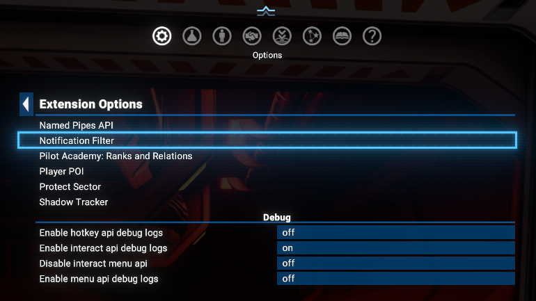
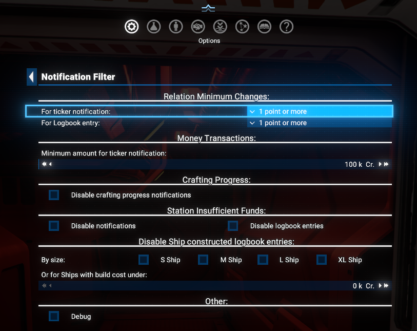
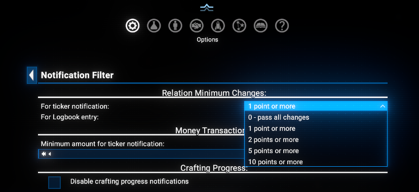

# Notification Filter

This mod introduces filtering functionality for some type of Notifications shown in the Ticker window and Logbook.

## Features

- **Intuitive UI**: Easily manage the filter values.
- **Simple to install**: Limited dependency - only on **Mod Support APIs**.

## Limitations

- The Academy currently only supports small (S-class) ships.
- Trades used for the training process are non-profitable and uses only one item of selected ware per transaction.

## Requirements

- **X4: Foundations**: Version 8.00HF3 or newer.
- **Mod Support APIs**: Version 1.95 or higher by [SirNukes](https://next.nexusmods.com/profile/sirnukes?gameId=2659).
  - Available on Steam: [SirNukes Mod Support APIs](https://steamcommunity.com/sharedfiles/filedetails/?id=2042901274)
  - Available on Nexus Mods: [Mod Support APIs](https://www.nexusmods.com/x4foundations/mods/503)

## Installation

- **Steam Workshop**: [Pilot Academy: Ranks and Relations](https://steamcommunity.com/sharedfiles/filedetails/?id=3669797690)
- **Nexus Mods**: [Pilot Academy: Ranks and Relations](https://www.nexusmods.com/x4foundations/mods/1985)

## Usage

After installation, please open the `Extension Option` menu.

Currently possible:

- Set minimum changes of `Relation` to be displayed in `Notification Ticker` and `Logbook` (Separately).
- Set a minimum amount of `Money` transaction to be displayed n `Notification Ticker`.

### Relation Minimum Changes

There are two different `Dropdowns` to define the minimum change of `Relation` to be displayed in `Notification ticker` or recorder into `Logbook`:

- `0 - pass all changes`: Equal to the `vanilla` game.
- `1 point or more`: Only changes of `Relation` equal or higher than 1 point will be visible.
- `2 points or more`: Only changes of `Relation` equal or higher than 2 points will be visible.
- `5 points or more`: Only changes of `Relation` equal or higher than 5 points will be visible.
- `10 points or more`: Only changes of `Relation` equal or higher than 10 points will be visible.

### Money Minimum Changes

There is a `Slider` to define the minimum amount of `Money` transaction to be displayed in `Notification ticker`.

Acceptable values are between `0` and `100,000,000` credits with `1000` credits step.
Zero value means that all transactions will be visible as in the `vanilla` game.

### Other

There is also a `Debug` checkbox to enable debug messages for the notifications that are being processed by the filter.

## Credits

- **Author**: Chem O`Dun, on [Nexus Mods](https://next.nexusmods.com/profile/ChemODun/mods?gameId=2659) and [Steam Workshop](https://steamcommunity.com/id/chemodun/myworkshopfiles/?appid=392160)
- *"X4: Foundations"* is a trademark of [Egosoft](https://www.egosoft.com).

## Acknowledgements

- [EGOSOFT](https://www.egosoft.com) — for the X series.
- [SirNukes](https://next.nexusmods.com/profile/sirnukes?gameId=2659) — for the `Mod Support APIs` that power the UI hooks.

## Changelog

### [8.00.00] - 2026-02-??

- **Added**
  - Initial public version
